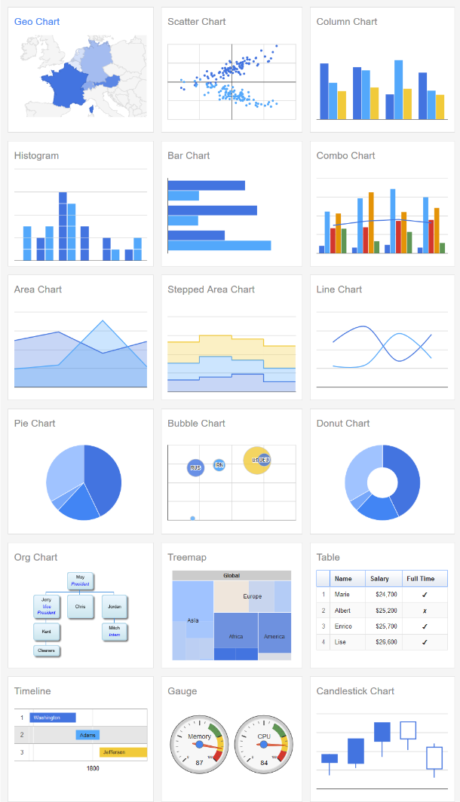
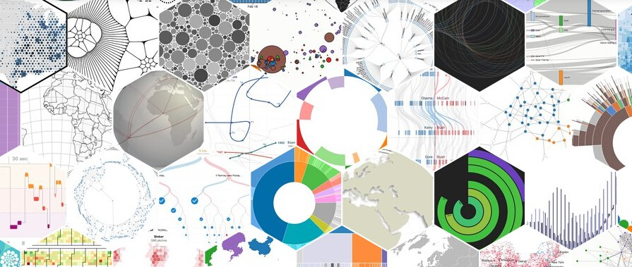
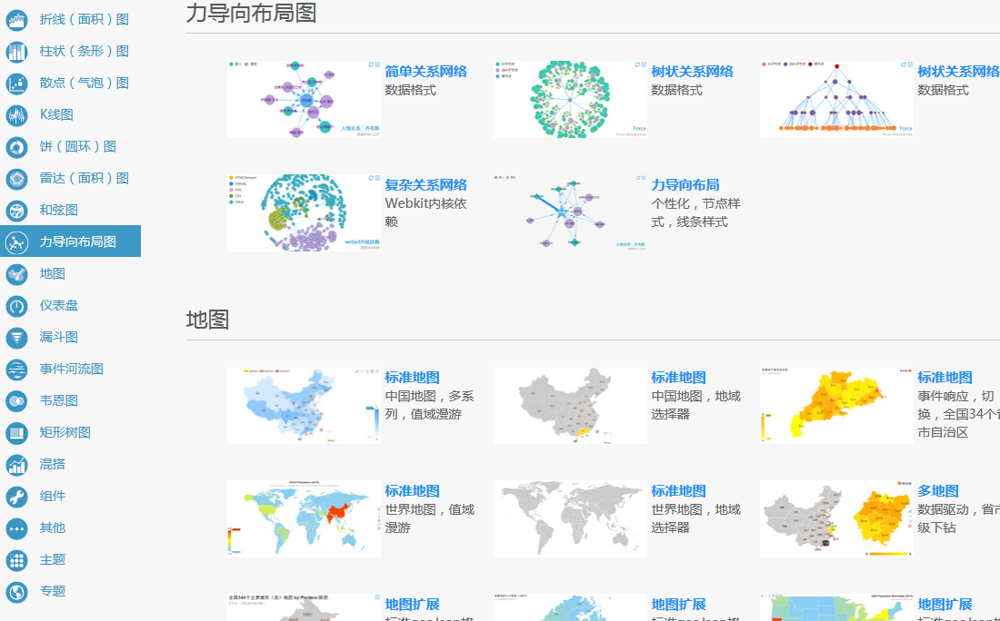
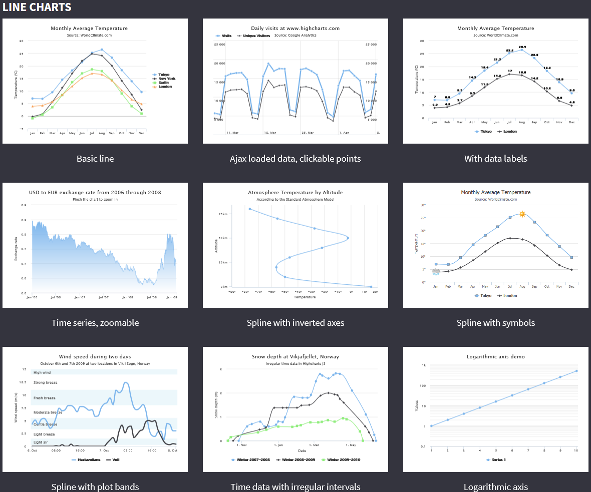
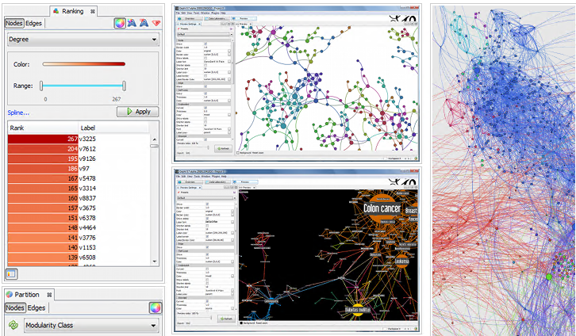
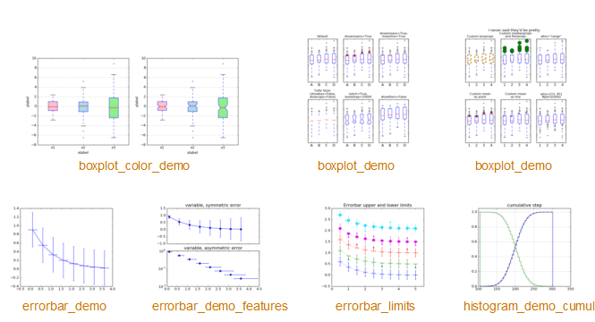

##可视化工具
###WEB平台的可视化工具
关于web平台的数据可视化，主要用到两种技术去实现。

一是`SVG`，SVG是可伸缩性的矢量图形，使用XML格式定义图形，SVG图像在放大或改变尺寸的情况下其图形质量不会损失。

二是`canvas`，canvas是HTML5提供的画布元素，通过JavaScript的API接口，就可以在画布上绘线图。canvas是基于像素的即时模式图形系统，适合一次性输出不作修改的图形。而SVG是文档对象模型的一部分，所以随时可以用脚本或者样式修改。

####Google Charts (SVG)

Google Charts是一个开源的JavaScript类库，通过调用预定的接口可以实现简单的折线图到复杂的层级树图。图表使用的是HTML5/SVG技术，提供跨浏览器和跨平台的兼容实现。原本Google Charts提供PNG接口，让用户通过http请求，传入数据，即可以返回具体PNG图表，但目前此服务已禁用。Google Charts是标准的图表服务工具，可以满足一般的通用网页图表展示。

####D3.js (SVG)
 

D3.js是用于操作基于数据文件的JavaScript可视化类库，它使用HTML、SVG和CSS的形式来实现数据可视化。D3.js通过文档对象模型DOM对象模型来绑定数据，再应用数据驱动转化到文档中，动态生成一个SVG图表，所以构建出来的可视化图可以进行良好的交互操作和平稳过渡。D3.js是非常灵活的，并不依赖其他JavaScript类库，其支持CSS3、HTML5和SVG的全部功能，这让它在浏览器中能够支持大型数据集和动态行为进行互动和动画。
使用D3.js只是一个绘制SVG的类库，可以自定义绘制图形的效果。目前D3.js提供各种简单到复杂的可视化表。
 

####百度 ECharts (Canvas)
 

Echart基于一个轻量级的Canvas类库ZRender，ZRender提供类Dom的事件模型，让Canvas绘图可以通过用户事件进行交互。 通过拖拽计算特性来允许用户对统计数据进行有效的提取、整合，甚至是多个图表间交换数据。目前Echarts经过多个版本的迭代，提供了多种类型的可视化图表。而且Echart是开源的js类库，是多种图形可视化不错的选择。
 

####Highcharts
 

Highcharts 是一个用纯JavaScript编写的一个图表库， 能够很简单便捷的在web网站或是web应用程序添加有交互性的图表，并且免费提供给个人学习、个人网站和非商业用途使用。HighCharts支持的图表类型有曲线图、区域图、柱状图、饼状图、散状点图和综合图表。Highcharts对个人用户免费，企业收费。Highcharts分为三个部分：通用图表，证券图表和地图类图表。其API基本上可以满足复杂数据的展示。
 
###其他平台：
####Processing 

所有平台兼容 

Processing 最早是一个用于教授计算机编程的简化编程语言。这些理念起源于 MIT Media Lab (John Maeda) 的 Design By Numbers 项目，目的是通过可视应用程序的开发来教授编程。Processing 极大地简化了展示静态数据、动态数据（比如动画）或交互数据的应用程序的构建。Processing 极大地简化了展示静态数据、动态数据（比如动画）或交互数据的应用程序的构建。
Processing 运行于 GNU/Linux® 以及 Mac OS X 和 Windows® 上，并且支持将图像导出成各种格式。对于动态应用程序，甚至可以将 Processing 应用程序作为 Java™ applet 导出以用在 Web 环境内。

目前，Processing有开发的WEB版本p5.js，其基于Canvas绘图。Processing是自定义可视化的重要工具。

####Gephi
 

Gephi是一款开源免费跨平台基于JVM的复杂网络分析软件, 其主要用于各种网络和复杂系统，动态和分层图的交互可视化与探测开源工具。可用作：探索性数据分析，链接分析，社交网络分析，生物网络分析等。gephi是一款信息数据可视化利器。Gephi是在Netbeans平台上开发，语言是JAVA，并且使用OpenGL作为它的可视化引擎。依赖于它的APIs，开发者可以编写自己感兴趣的插件，创建新的功能。

#### matplotlib
 

如果是使用python，matplotlib真实不可或缺。其实现的功能与MATLAB的画图功能相似。而其官方网站[http://matplotlib.org/](http://matplotlib.org/)拥有大量的例子可供查看。真实论文必备可视化工具。同时，如果想深入可视化的实现，可以在github上找到源码来研究：[https://github.com/matplotlib/matplotlib](https://github.com/matplotlib/matplotlib)。

By Chunzhen 20160421